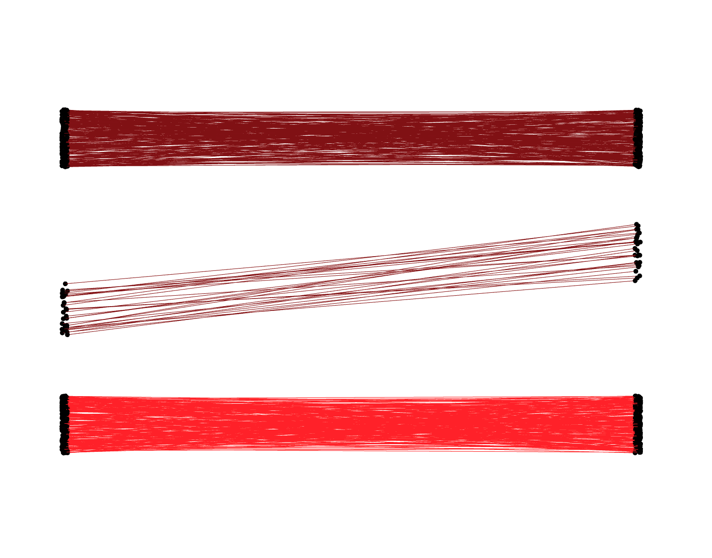
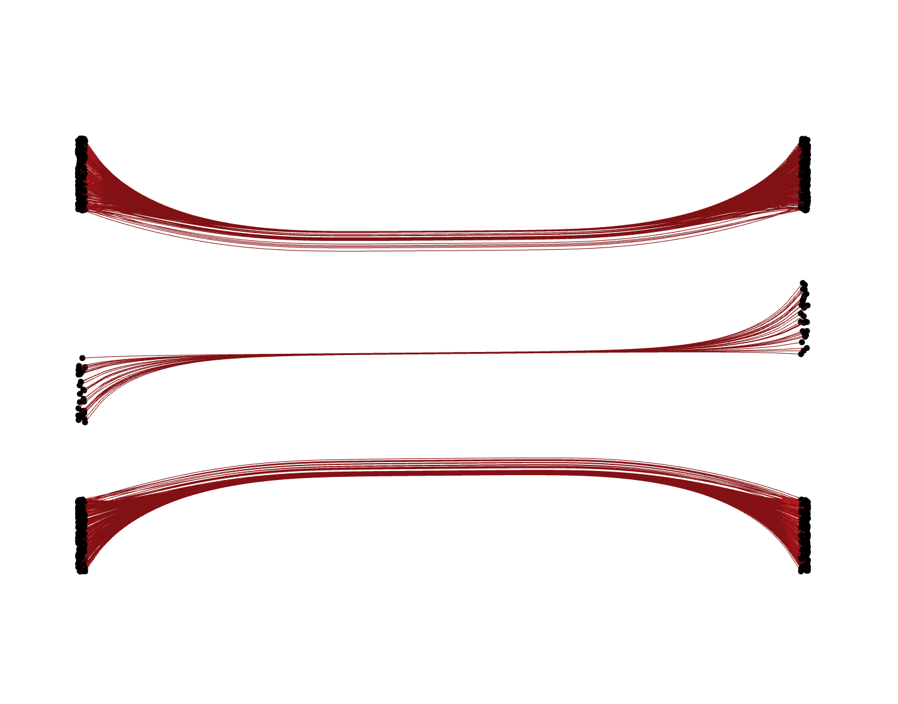
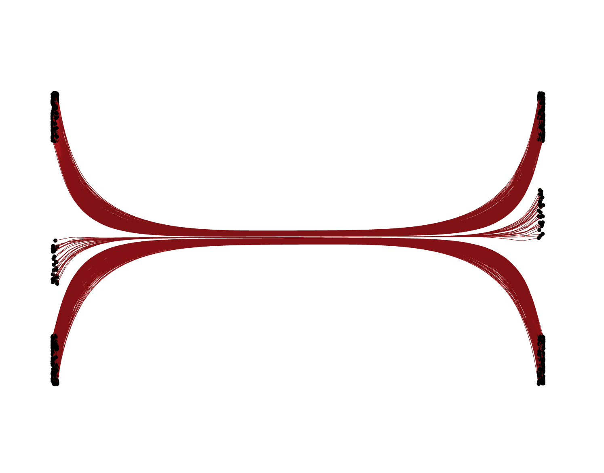
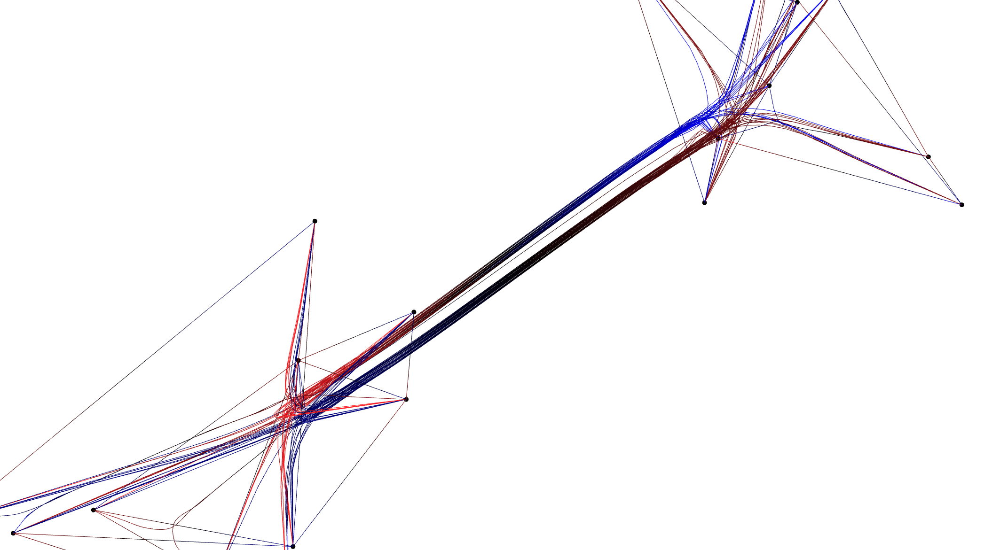

# Extended MSEB (xMSEB): Enhanced Brain Bundling Algorithm

The **Extended MSEB (xMSEB)** project builds upon the original [Brain Bundler](https://github.com/NeuroanatomyAndConnectivity/brainbundler) tool by incorporating improvements to the Mean Shift Edge Bundling (MSEB) algorithm. This repository provides the upgraded source files for extending and refining the bundling of brain connectivity data. 

Our code is available at [**github.com/xMSEB/xMSEB**](https://github.com/xMSEB/xMSEB)!

---
Original Dataset.

Bundled Output.

Low c_thr value, we are bundling every edge.

(Depending on one parameter (c_thr, meaning: compatibility threshold) we can adjust what similar edges we are bundling together.)
---
## Overview

**Extended MSEB** is designed to improve the visual and structural clarity of bundled brain connectivity graphs. It enhances the original mean-shift bundling algorithm to produce smoother, more anatomically faithful bundles while maintaining compatibility with the existing `brainbundler` framework.

The base functionality comes from **brainbundler**, which includes:

- **Bundler** — a command-line tool for mean-shift edge bundling
- **FibViewer** — a simple 3D viewer for `.fib` files generated by the bundler

The Extended MSEB version modifies key components in the bundling process for better performance and visual quality.


---

## xMSEB improvements over MSEB

xMSEB has improved MSEB in the following areas:

- **Native edge weight handling**: Now the edges can have weights (positive float values) and the bundling algorithm. Meaning, the new mean location (of the bundled edges) is weighted both by proximity and also by weight of the edges being compared. For MSEB to do this, the user needs to duplicate edges as many times as the edge weight for a particular edge, which increases the number of edges, thus increasing the runtime of the program.
- **Directed Edge Bundling**: Now, xMSEB, can bundles edges by direction, meaning, that edges which are parallel are separate from anti-parellel edges.

- **Proper Benchmarking**: Previous papers that presented edge bundling algorithms lacked qualitative and objective benchmarks. We tried to introduce our own datasets with the current ones and created a benchmark evaluator in Python.
- **Faster Runtime over MSEB**: Improved the runtime of MSEB by using missed tricks, starting the bundling on already segmented edges and adding edge momentum, which helps to convergence the visualization faster.
- **Updated Fibviewer**: Added Coloring by edge direction, position and zoom input/output fields (for reproducibility and comparison tests), inner and ending points shower and Catmull-Rom spline interpolation for a more smooth visual result.

---

## Installation and Setup

The easiest way to set up the **xMSEB** algorithm is as follows:

1. **Install Qt**

   - Instructions for setting up Qt can be found here:  
     [Setting Up QT](https://doc.qt.io/qt-6/get-and-install-qt.html)

1. **Clone Repository**
   - Clone our repository: [xMSEB](https://github.com/ToporDB/xMSEB).
1. **Compiling xMSEB**

   - **Bundler** and **FibViewer** are part of the repository and needs to be built by QT Creator, so after downloading it, open the bundler/bundler.pro and fibviewer/fibviewer.pro files with QT Creator.
   - Inside QT Creator, click on the "Build Project" (lower left corner) for both bundler and fibviewer software.
   - QT will create a build/Desktop-(Debug/Release/Profile)/ folders inside the software directory, where inside, you will find the runnable executables bundler or fibviewer.

1. **Running the project**
   - Use the executables to run your dataset and visualize it with fibviewer.

---

## Usage

After building, you can use the extended bundler just like the original:

```bash
bundler -nodes "nodes.txt" -cons "edges.txt" -fileName "output_name" [-c_thr 0.8] [-start_i 10] [-numcycles 7] [-bell 5] [-directed 0] [-smooth 3]
fibviewer "output_name".fib
```

## Input File Formats

### Node File

Each line contains one node’s 3D coordinates:

```
x0 y0 z0
x1 y1 z1
x2 y2 z2
...
```

### Connections File

Each line defines an edge between two nodes (0-indexed):

```
0 3
2 3
4 1
...
```

To convert ASCII node/connection files into a `.fib` file:

```bash
bundler -nodes "nodesfile" -cons "connectionsfile" -numcycles 0
```

---

## Parameters

| Parameter    | Description                                             | Default |
| ------------ | ------------------------------------------------------- | ------- |
| `-c_thr`     | Compatibility threshold — determines bundling tightness | `0.8`   |
| `-start_i`   | Iterations in the first cycle                           | `10`    |
| `-numcycles` | Total number of bundling cycles                         | `7`     |
| `-bell`      | Width of Gaussian kernel for weighting                  | `5`     |
| `-smooth`    | Number of smoothing steps after bundling                | `3`     |
| `-directed`  | Directed Bundling wanted (0 or 1)                       | `0`     |

---

## Visualizing Results

To visualize or export bundled data:

```bash
fibviewer "output.fib"
```

Example datasets (like `artificialconnections`) can be used for quick testing:

```bash
fibviewer artificial -writefib
fibviewer artificial.fib -writeobj
```

## License & Citation

This project builds upon the open-source **brainbundler** framework.  
Please cite the original authors and this repository when using the xMSEB algorithm in research or publications.

---

## GitHub Pages

Documentation, Code and examples can be found on the GitHub Pages site:  
 [**github.com/xMSEB/xMSEB**](https://github.com/xMSEB/xMSEB)

## Master's thesis

This project was my Master's thesis while studying at Aarhus University, and I am proud to share our findings. To read more about our project, please see our Master's thesis:
[Download Master's Thesis (PDF)](MSc_thesis_TDB.pdf)

---

**Contributors:**  
[Daniel-Bálint Topor] – Extended MSEB Implementation  
Original BrainBundler by [Neuroanatomy and Connectivity Group](https://github.com/NeuroanatomyAndConnectivity)
